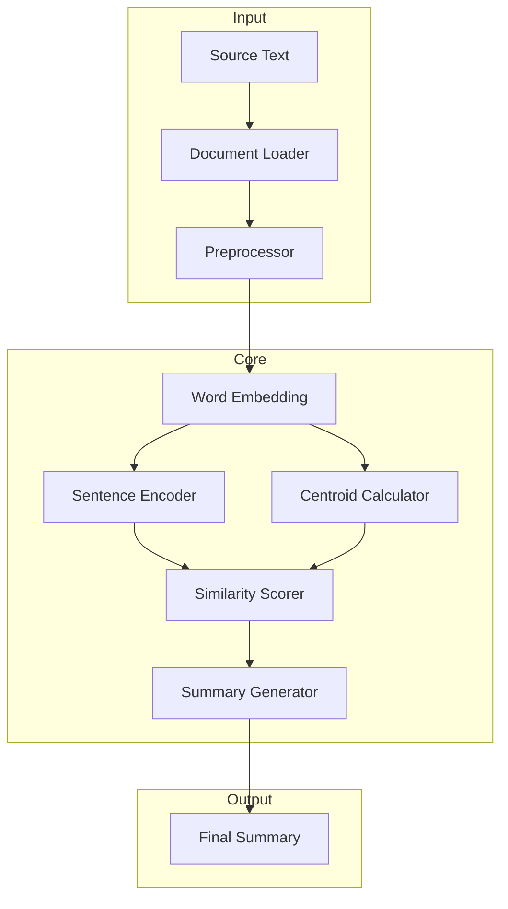

# Centroid-Based Text Summarization for Humanities


A powerful text summarization tool designed for humanities and social science texts, using word embeddings to capture nuanced meanings and thematic elements.

## Overview

This tool helps researchers automatically generate summaries of academic texts while preserving key concepts and arguments. It uses a centroid-based approach combined with modern word embeddings to ensure semantic understanding.

## System Architecture



## Quick Start

### Installation
```bash
git clone https://github.com/username/centroid-summarization.git
cd centroid-summarization
pip install -e .
```

### Basic Usage
```python
from summarizer import CentroidSummarizer

# Initialize
summarizer = CentroidSummarizer(embedding_model='word2vec')

# Generate summary
text = """Your text here..."""
summary = summarizer.summarize(text, ratio=0.3)
```

### Advanced Usage
```python
summarizer = CentroidSummarizer(
    embedding_model='glove',
    min_sentence_length=10,
    similarity_threshold=0.7,
    use_gpu=True
)
```

## Key Features

- 🎯 Specialized for academic texts
- 🔤 Multiple embedding models (Word2Vec, GloVe, BERT)
- 📊 Configurable summary length and density
- 🚀 GPU acceleration support
- 📝 Citation and reference preservation

## Project Structure
```
centroid-summarization/
├── src/
│   ├── summarizer/
│   │   ├── core.py          # Core logic
│   │   ├── embeddings.py    # Embedding models
│   │   └── preprocessing.py # Text processing
│   └── tests/              # Unit tests
├── examples/               # Usage examples
└── README.md
```

## Evaluation

| Metric | Score |
|--------|--------|
| ROUGE-1 | 0.456 |
| ROUGE-2 | 0.238 |
| ROUGE-L | 0.412 |

## Contributing

1. Fork the repository
2. Create your feature branch (`git checkout -b feature/YourFeature`)
3. Commit your changes (`git commit -m 'Add YourFeature'`)
4. Push to the branch (`git push origin feature/YourFeature`)
5. Open a Pull Request

## License

MIT License - see [LICENSE](LICENSE) file for details.

---
⭐ If you find this project useful, please consider giving it a star!
